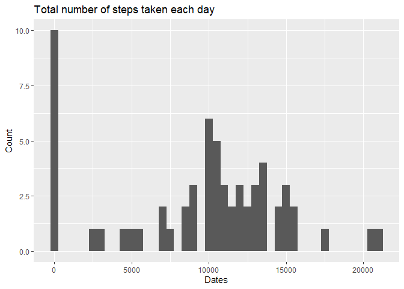
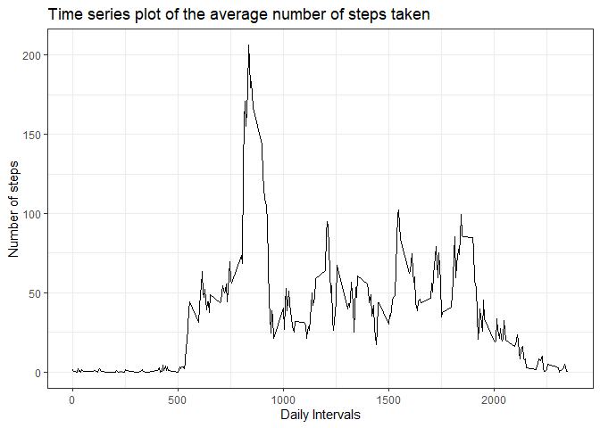
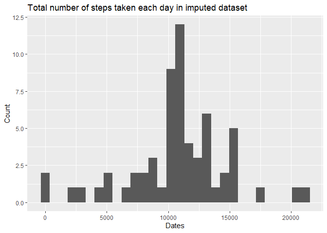
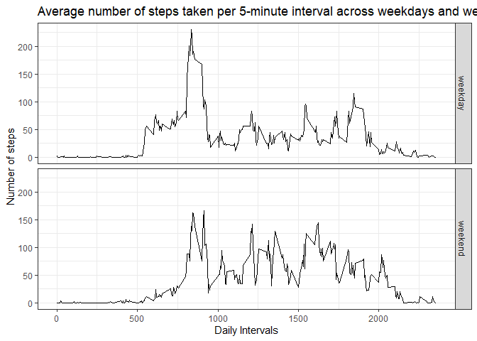

## Libraries for the code formulation

```r
library(dplyr)
library(ggplot2)
library(chron)
```

## Code for reading in the dataset and/or processing the data


```r
activity <- read.csv("activity.csv")
```
## Histogram of the total number of steps taken each day


```r
sums <- tapply(activity$steps, activity$date, FUN = sum , na.rm = TRUE)
qplot(sums, binwidth = 500, xlab = "Dates", ylab = "Count", main = "Total number of steps taken each day")
```

<!-- -->

## Mean and median number of steps taken each day


```r
mean(sums)
```

```
## [1] 9354.23
```

```r
median(sums)
```

```
## [1] 10395
```
## Time series plot of the average number of steps taken

```r
stepsperinterval <- activity %>% group_by(interval) %>% summarize(stepsums = sum(steps, na.rm = TRUE))
g <- ggplot(stepsperinterval, aes(interval, stepsums))
g + geom_line() + theme_bw(base_family = "Times") + labs(title = "Time series plot of the average number of steps taken",x = "Daily Intervals", y = "Number of steps")
```

<!-- -->

## The 5-minute interval that, on average, contains the maximum number of steps


```r
as.integer(stepsperinterval[which.max(stepsperinterval$stepsums),1])
```

```
## [1] 835
```
## Imputing missing values

```r
filled <- activity[!is.na(activity$steps), ]
empty <- activity[is.na(activity$steps), ]
filledmean_per_interval <- filled %>% group_by(interval) %>% summarize(average = mean(steps))
empty$steps <- ifelse(empty$interval == filledmean_per_interval$interval, filledmean_per_interval$average)
imputed <- rbind(filled, empty)
imputed$date <- as.Date(imputed$date)
imputed <- imputed[order(imputed$date),]
```

## Histogram of the total number of steps taken each day after missing values are imputed

```r
imputedsums <- tapply(imputed$steps, imputed$date, FUN = sum)
qplot(imputedsums, xlab = "Dates", ylab = "Count", main = "Total number of steps taken each day in imputed dataset")
```

<!-- -->

## Panel plot comparing the average number of steps taken per 5-minute interval across weekdays and weekends

```r
imputed$week.status <- ifelse(is.weekend(imputed$date), yes = "weekend", no = "weekday")
imputed_days <- imputed %>% group_by(week.status, interval) %>% summarize(average = sum(steps))
g <- ggplot(imputed_days, aes(interval, average))
g + geom_line() + facet_grid(week.status~.) + theme_bw(base_family = "Times") + labs(title = "Average number of steps taken per 5-minute interval across weekdays and weekends", x = "Daily Intervals", y = "Number of steps")
```

<!-- -->

As we can see there seem to be differences in activity patterns between weekdays and weekends.
